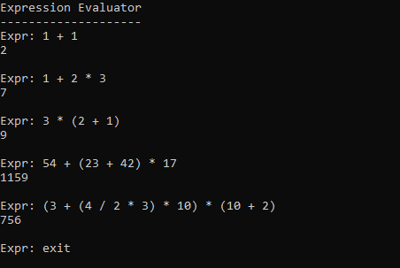

# Expression Evaluator

C# Console App to evaluate multi-operator bracketed expressions.

e.g.  
`54 + (23 + 42) * 17` -> `54 23 42 + 17 * +` -> `1159`.  
`(3 + (4 / 2 * 3) * 10) * (10 + 2)` -> `3 4 2 / 3 * 10 * + 10 2 + *`
-> `756`.



# Why?

The first thing you may be thinking is "Can't you achieve this in a few
lines of code referencing the standard library?"

The answer is yes.
```cs
using System.Data;

string expr = "1 + 2 * (3 + 4)";

DataTable table = new();
string value = table.Compute(expr, string.Empty).ToString() ?? "";

Console.WriteLine(value);   // 15
```

"So why then have you written your own version?"

Because it seemed like a fun challenge :)

## Reverse Polish Notation

And it was fun. Evaluating expressions in infix notation (where the
operator sits between its two operands) e.g. '1 + 2 * 3 + 4' is actually
quite difficult to compute. Instead, if we can convert it into postfix
notation (also known as Reverse Polish Notation; where the operator sits
after its two operands) e.g. `1 2 3 * + 4 +` it becomes much simpler.

To evaluate an RPN expression, we can search through one token at a time;
if the token is an operand, push it to the value stack; if the token is an
operator, pop the previous two operands from the value stack compute the
simple expression result and push the result back to the value stack.

Assuming the expression is valid, you should end up with a single value in
the value stack at the end.

For `1 2 3 * + 4 +`, the stack state after each step is as follows:
```
1
1 2
1 2 3
1 6      (*)
7        (+)
7 4
11       (+)
```

## Infix -> Reverse Polish Notation

You can convert from Infix notation to Reverse Polish by using the
Shunting-yard algorithm.

Fundamentally, tokenise your input (`11 + 2 * 3` ->
`['11', '+', '2', '*', '3']`), then look through one by one.

- If token is operand,
    - Push to the output.
- If token is operator,
    - While token has a lower / equal precedence to the head of the
    operator stack,
        - Pop operator from operator stack and push straight to the output.
    - Push token to the operator stack.

Once you've looked through the whole list, make sure to pop the remaining
operators from the operator stack and push them to the output.

## Brackets

### Difficulty

The basic Shunting-yard algorithm doesn't play well with brackets.

For example, let's look at just the operator stack if you have
`3 * (2 + 1)`. First, you push '*' to the stack.
Then you see '(' which should have a higher precedence than '*', so it
should be pushed to the stack too.
Then you see '+' which should have a lower precedence than '(', so we pop
'(' (and then '*') from the stack and push them to the output.  
The final result is `3 2 ( * 1 ) +` which is incorrect.

The problem occurs for brackets because they depend on each other; whereas
a '+' or a '-' has meaning on it's own, a '(' doesn't.

### Solution

The typical solution is to just handle brackets as their own tokens rather
than as generic operators.

I saw an opportunity to do some structured data processing however, and use
an LL(1) parser to parse expressions.

An expression can contain other expressions inside it.  
When we detect the end of these inner expressions, we can evaluate them
using the simple Shunting-yard case and push the result to the parent
expression.

This way, we can evaluate brackets first and pick the nested expression
problem out of every input string.

In order to do structured data processing, we need to design the schema
that the data should match.  
See
<a href='https://github.com/BenTaylor25/ExpressionEvaluator/blob/master/Grammar.md'>
Grammars.md</a> for more detail.
